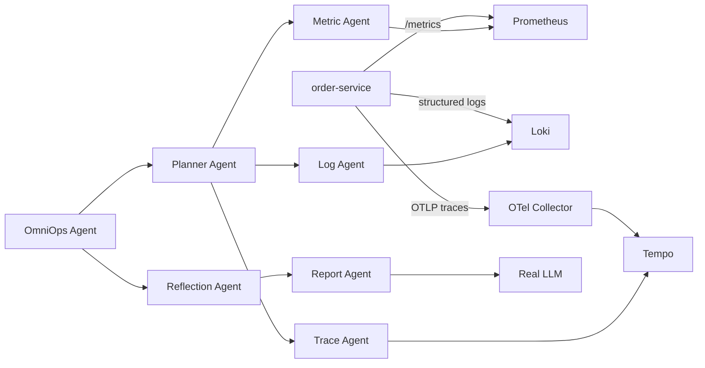

# OmniOps Agent

[](https://github.com/fhs1220888/omniops-agent/actions/workflows/ci.yml)

## Project Overview

OmniOps is an observability-driven Agent Harness for multi-agent incident diagnosis and RCA.

OmniOps Agent is a Python incident diagnosis MVP built with FastAPI, LangGraph, and LangChain-compatible abstractions. It simulates an enterprise incident intelligence workflow: create an incident, plan the investigation, run selected diagnostic tools concurrently, enforce tool risk policy, recall similar incidents, build an evidence graph, and generate an RCA report with AgentOps traces.

The current implementation is intentionally local-first. It supports deterministic fake tools for tests, file-backed observability records for exported real data, live Prometheus/Loki/Tempo providers, local JSON incident memory, and an OpenAI-compatible LLM layer.

## Why This Is Not A Chatbot

OmniOps Agent is not a generic chat interface over logs. The core unit is an incident, not a conversation. The system produces structured diagnosis artifacts:

- investigation plan
- executed and skipped tools
- Tool Gateway policy decisions
- approval requests for high-risk tools
- evidence items and evidence graph
- agent and tool traces
- RCA report and recommended actions
- benchmark metrics against ground truth scenarios

The design focuses on explainable incident diagnosis and safe tool orchestration rather than free-form Q&A.

## Architecture

```text
FastAPI API
  -> LangGraph diagnosis workflow
      -> planner
      -> triage
      -> async investigation
          -> Tool Gateway
          -> fake, file-backed, or live logs / metrics / traces / local memory
      -> Evidence Graph
      -> report
```



Core packages:

- `app/api/`: FastAPI routers for incidents, approvals, and demo endpoints.
- `app/agents/`: LangGraph nodes and agent orchestration.
- `app/harness/`: Agent Harness contracts for config, policy, traces, evidence, and result summaries.
- `app/tools/`: observability tools, Tool Gateway, registry, and policy engine.
- `app/memory/`: local JSON incident memory and similar incident recall.
- `app/rag/`: pure Python in-memory evidence graph.
- `app/services/`: approval and benchmark services.
- `app/demo/`: deterministic demo fault scenarios and ground truth.
- `app/models/`: Pydantic schemas for incidents, traces, evidence, approvals, and diagnosis output.

More detail is in [docs/architecture.md](/Users/fhs1220/omniops-agent/docs/architecture.md).

## Agent Harness Design

OmniOps is organized as an Agent Harness, not a prompt wrapper. The LLM is one model component used by the report step. The harness is the engineering layer around the model: it plans work, governs tools, normalizes evidence, tracks execution, reflects on sufficiency, exposes runtime status, and verifies live demo mode.

```text
LLM Model
   ^
Report / Reflection Agents
   ^
OmniOps Agent Harness
   |-- Planner
   |-- Tool Gateway
   |-- Evidence Contract
   |-- Execution Trace
   |-- Observability Providers
   `-- Runtime Status
        |-- Prometheus
        |-- Loki
        `-- Tempo
```

Harness components:

- `Planner`: chooses which investigation tools are needed for the incident.
- `Tool Gateway`: applies allow/review/deny policy before execution.
- `Evidence Contract`: requires tool outputs to declare source, empty/error state, and evidence items.
- `Execution Trace`: unifies agent steps, tool calls, evidence, and failures.
- `Observability Providers`: connect fake, file, or live Prometheus/Loki/Tempo modes behind one interface.
- `Runtime Status`: proves whether the system is fake, file-backed, or live real mode.

In live mode, fake tool fallback is explicitly disabled. If Prometheus, Loki, or Tempo are empty or unreachable, the diagnosis must carry that limitation instead of inventing evidence. This is the project boundary that makes the harness more than a chatbot: the model is constrained by planning, policy, evidence contracts, runtime checks, and deterministic evaluation scripts.

Harness status API:

```bash
curl http://127.0.0.1:8001/api/harness/status
```

## Core Workflow

```text
planner -> triage -> async investigation -> Tool Gateway -> Evidence Graph -> report
```

1. `planner` selects needed tools from `logs`, `metrics`, `traces`, and `memory`.
2. `triage` sets the affected service and investigation time window.
3. `async investigation` runs selected tools concurrently with timeout and failure isolation.
4. `Tool Gateway` evaluates each tool call with allow/review/deny policy.
5. `Evidence Graph` links services, log patterns, metrics, traces, memory, and hypotheses.
6. `report` generates RCA, recommended actions, evidence summary, agent timeline, and tool timeline.

## Key Features

- FastAPI API for incidents, approvals, and demos.
- LangGraph workflow with planner-driven routing.
- Async parallel investigation with per-tool timeout handling.
- Tool Gateway with risk policy:
  - low-risk tools are allowed
  - high-risk tools require human approval
  - critical tools are denied
- Human approval workflow with in-memory approval requests.
- Local JSON incident memory and keyword-overlap similar incident recall.
- Optional OpenAI-compatible LLM diagnosis layer.
- Fake LLM mode for deterministic local tests, with real LLM mode for local runs.
- Three observability modes: fake tools, file-backed exported records, and live Prometheus/Loki/Tempo.
- AgentOps traces for planner, triage, investigation, and report agents.
- Tool call traces with policy decision, risk level, duration, status, and error.
- Normalized evidence items and pure Python evidence graph.
- Deterministic demo scenarios and benchmark suite.

## Demo Scenarios

The benchmark suite includes four fake scenarios:

- `redis_timeout`
- `mysql_slow_query`
- `kafka_lag`
- `bad_config_deploy`

These are local deterministic data fixtures. They do not start Redis, MySQL, Kafka, Docker, or any external service.

## Diagnostic Capability Matrix

OmniOps currently supports live diagnosis for these microservice runtime failure types:

- Redis timeout / connection pool exhaustion
- Downstream service timeout
- DB slow query / missing index signal
- Application exception / 500 spike
- Service unhealthy / 503
- Latency spike
- Evidence insufficient handling

See [docs/diagnostic_capability_matrix.md](/Users/fhs1220/omniops-agent/docs/diagnostic_capability_matrix.md).

Run the live diagnostic benchmark after starting the live stack and OmniOps API:

```bash
uv run python scripts/run_diagnostic_benchmark.py
```

## Benchmark Results

Latest generated report: [benchmark_report.md](/Users/fhs1220/omniops-agent/benchmark_report.md)

Current benchmark summary:

- Scenario count: `4`
- RCA accuracy: `1.0`
- Evidence precision: `1.0`
- Average duration ms: `0.359`
- Average agent count: `4.0`
- Average tool count: `2.5`

Run the benchmark through the API:

```bash
curl http://127.0.0.1:8000/api/demo/benchmark
```

Or regenerate the Markdown report from Python:

```bash
uv run python -c "from app.services.benchmark_service import run_benchmark; run_benchmark()"
```

## How To Run Tests

```bash
uv run pytest -q
```

Expected current result:

```text
63 passed, 3 skipped, 1 warning
```

The warning is a FastAPI/Starlette `TestClient` deprecation warning and does not affect behavior.

## Quality Gates

- Unit tests: `73 passed`
- Live integration tests: skipped by default unless `RUN_REAL_OBSERVABILITY_TESTS=true`
- Repo safety check: ensures `.env`, API keys, caches, logs, and volume data are not tracked
- Live demo: `scripts/demo_live.sh`

Run local quality gates:

```bash
uv run pytest -q
uv run python scripts/check_repo_safety.py
```

## How To Run API Locally

```bash
uv sync --extra dev
uv run uvicorn app.main:app --reload
```

Open:

- API docs: `http://127.0.0.1:8000/docs`
- OpenAPI JSON: `http://127.0.0.1:8000/openapi.json`

## Runtime Modes

Mode 1: fake tools.

```env
USE_FAKE_TOOLS=true
OBSERVABILITY_BACKEND=fake
```

Use this for unit tests, deterministic demo scenarios, and offline development.

Mode 2: file observability.

```env
USE_FAKE_TOOLS=false
OBSERVABILITY_BACKEND=file
OBSERVABILITY_DATA_FILE=/absolute/path/to/observability.json
```

Use this for logs, metrics, and traces exported from real systems. The JSON file must contain top-level `logs`, `metrics`, and `traces` arrays. See [data/observability_external_example.json](/Users/fhs1220/omniops-agent/data/observability_external_example.json:1).

Mode 3: live observability with Prometheus, Loki, and Tempo.

```env
USE_FAKE_TOOLS=false
OBSERVABILITY_BACKEND=prometheus_loki_tempo
PROMETHEUS_URL=http://localhost:9090
LOKI_URL=http://localhost:3100
TEMPO_URL=http://localhost:3200
```

This mode directly queries live backends. If a backend is unreachable or returns no data, the tool returns an explicit empty/error result and does not fall back to fake data.

## Real LLM And Live Real Mode

Use real LLM mode:

```env
USE_FAKE_LLM=false
LLM_PROVIDER=openai-compatible
LLM_BASE_URL=https://api.openai.com/v1
LLM_API_KEY=...
LLM_MODEL=gpt-4o-mini
```

The fully live real mode is:

```env
USE_FAKE_LLM=false
USE_FAKE_TOOLS=false
OBSERVABILITY_BACKEND=prometheus_loki_tempo
```

For interview demos, verify runtime mode with:

```bash
uv run python scripts/check_runtime_status.py
```

## Live Real Observability Demo

This path runs real local observability backends and a real instrumented demo service. Logs, metrics, and traces are produced by `order-service` and queried back through Loki, Prometheus, and Tempo.

Before running the live demo, configure `.env` from the safe template and manually add your API key:

```bash
cp .env.live.example .env
# Manually set LLM_API_KEY in .env
```

One-command demo:

```bash
bash scripts/demo_live.sh
```

Stop the demo stack:

```bash
bash scripts/stop_live_demo.sh
```

Stop the stack and remove volumes:

```bash
bash scripts/stop_live_demo.sh --volumes
```

Manual command chain:

```bash
cd /Users/fhs1220/omniops-agent
docker compose -f deploy/docker-compose.observability.yml up -d
uv run python scripts/generate_demo_traffic.py
uv run uvicorn app.main:app --reload --port 8001
uv run python scripts/run_live_demo_check.py
uv run python scripts/check_runtime_status.py
uv run python scripts/smoke_real_observability.py
```

Useful local URLs:

- OmniOps dashboard: `http://127.0.0.1:8001/`
- order-service: `http://127.0.0.1:8002/health`
- Prometheus: `http://127.0.0.1:9090/`
- Loki: `http://127.0.0.1:3100/ready`
- Tempo: `http://127.0.0.1:3200/ready`
- Grafana: `http://127.0.0.1:3000/`

Live real mode requires:

```env
USE_FAKE_LLM=false
USE_FAKE_TOOLS=false
OBSERVABILITY_BACKEND=prometheus_loki_tempo
```

If Prometheus, Loki, or Tempo are unreachable or empty, the tools return explicit `empty`/`error` evidence. They do not fall back to fake data.

Expected live backend check:

```json
{
  "live_real_mode": true,
  "prometheus": {
    "reachable": true,
    "up": true
  },
  "loki": {
    "reachable": true,
    "log_count": 34
  },
  "tempo": {
    "reachable": true,
    "found": true
  }
}
```

Expected runtime status:

```json
{
  "fake_llm_enabled": false,
  "fake_tools_enabled": false,
  "llm_mode": "real",
  "tools_mode": "real",
  "observability_backend": "prometheus_loki_tempo",
  "prometheus_reachable": true,
  "loki_reachable": true,
  "tempo_reachable": true
}
```

Expected smoke diagnosis:

```json
{
  "executed_tools": ["logs", "metrics", "traces"],
  "tool_sources": ["loki", "prometheus", "tempo"],
  "root_cause": "Redis connection pool exhaustion in order-service.",
  "confidence": 0.87
}
```

The demo is not using fake logs, metrics, or traces when all of these are true:

- `fake_tools_enabled` is `false`
- `tools_mode` is `real`
- `observability_backend` is `prometheus_loki_tempo`
- `tool_sources` are `loki`, `prometheus`, and `tempo`
- `run_live_demo_check.py` shows Prometheus, Loki, and Tempo all reachable

## API Endpoints

Incidents:

- `POST /api/incidents`
- `GET /api/incidents/history`
- `GET /api/incidents/{incident_id}`
- `POST /api/incidents/{incident_id}/analyze`
- `POST /api/incidents/{incident_id}/diagnose`
- `POST /api/incidents/{incident_id}/resolve`

Approvals:

- `GET /api/approvals/pending`
- `POST /api/approvals/{approval_id}/approve`
- `POST /api/approvals/{approval_id}/reject`

Demo:

- `GET /api/demo/scenarios`
- `POST /api/demo/run/{scenario_name}`
- `GET /api/demo/benchmark`
- `POST /api/demo/high-risk-tool`

Harness and runtime:

- `GET /api/runtime/status`
- `GET /api/harness/status`

## Example API Flow

Create an incident:

```bash
curl -X POST http://127.0.0.1:8000/api/incidents \
  -H "Content-Type: application/json" \
  -d '{
    "title": "OrderService Redis timeout and checkout latency",
    "service": "order-service",
    "severity": "high",
    "description": "RedisTimeoutException and p95 latency spike"
  }'
```

Diagnose it:

```bash
curl -X POST http://127.0.0.1:8000/api/incidents/{incident_id}/diagnose
```

Trigger a high-risk tool approval demo:

```bash
curl -X POST http://127.0.0.1:8000/api/demo/high-risk-tool
```

List pending approvals:

```bash
curl http://127.0.0.1:8000/api/approvals/pending
```

## Design Tradeoffs

- Local first: no database, Redis, Kafka, Docker, vector DB, Neo4j, or frontend.
- Local observability abstraction first: deterministic tool data keeps tests stable, file-backed records support exported real data, and live providers support Prometheus/Loki/Tempo.
- Tool Gateway before real tools: policy, approval, denial, and tracing exist before dangerous integrations.
- In-memory approval service: sufficient for MVP and tests; persistence can come later.
- JSON file memory: simple similar incident recall without pgvector or RAG infrastructure.
- Evidence graph is pure Python: enough to demonstrate explainability without introducing graph database complexity.
- Fake LLM mode is default for tests: real OpenAI-compatible calls are optional and isolated.

## Future Work

- Add richer provider-specific query templates for Loki, Prometheus, Tempo, Datadog, and CloudWatch.
- Add durable storage for incidents, approvals, traces, and benchmark runs.
- Add real RAG over runbooks and historical RCA documents.
- Add vector search when there is enough document volume to justify it.
- Add real MCP adapters for external tools.
- Add LangSmith or OpenTelemetry export for AgentOps traces.
- Add a lightweight dashboard for demo visualization.
- Add richer benchmark datasets with noisy, mixed, and ambiguous incidents.
